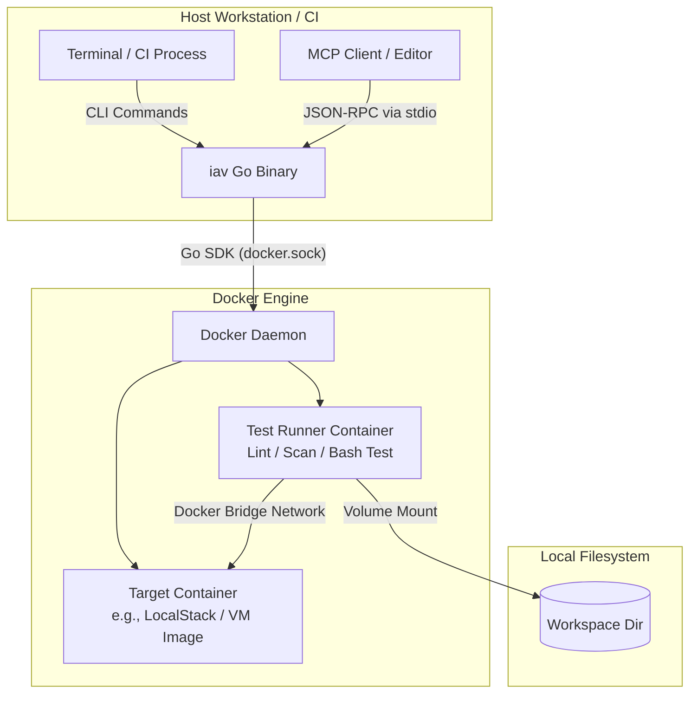

# Specification: iav (Infrastructure-as-Vibe)
## Local CLI & MCP Test Runner

## 1. Overview & Architecture

The `iav` tool is a single Go binary that operates in two modes:
1. **CLI Mode:** Directly run by developers in local terminals or CI/CD pipelines (e.g. `iav terraform test --dir .`).
2. **MCP Mode:** Executed by AI clients (e.g., Cursor, Claude) as a Model Context Protocol (MCP) server communicating via JSON-RPC 2.0 over standard I/O (invoked via `iav --mcp`).

All linters, test runners, and target environments (such as LocalStack) run in sibling Docker containers. The server communicates directly with the Docker daemon via the official Go SDK (`github.com/docker/docker/client`).

A companion `SKILL.md` is provided in the workspace to instruct AI agents on how to leverage both the CLI commands and the MCP tools.



---

## 2. Tool & Command Executions

The core execution engine is shared between the CLI and MCP interfaces.

```go
package main

import "context"

type ExecutionContext struct {
	WorkspaceRoot        string            `json:"workspace_root"`
	InfraDir             string            `json:"infra_dir"`
	TestScript           string            `json:"test_script"`
	TimeoutMs            int               `json:"timeout_ms"`
	EnvironmentVariables map[string]string `json:"environment_variables"`
}

type StageResult struct {
	StageName  string `json:"stage_name"`
	Success    bool   `json:"success"`
	DurationMs int64  `json:"duration_ms"`
	Stdout     string `json:"stdout"`
	Stderr     string `json:"stderr"`
}

type TestExecutionResult struct {
	Success  bool          `json:"success"`
	ExitCode int           `json:"exit_code"`
	Stages   []StageResult `json:"stages"`
	Summary  string        `json:"summary"`
}

type IExecutionRunner interface {
	Initialize(ctx context.Context) error
	ExecuteTerraformTest(ctx context.Context, execCtx *ExecutionContext) (*TestExecutionResult, error)
	ExecuteAnsibleTest(ctx context.Context, execCtx *ExecutionContext) (*TestExecutionResult, error)
	ExecuteDockerTest(ctx context.Context, execCtx *ExecutionContext) (*TestExecutionResult, error)
	Cleanup(ctx context.Context) error
}
```

---

## 3. Tool & Command Specifications

The CLI commands map directly to the corresponding MCP tool schemas.

### 3.1 `terraform_test` (CLI: `iav terraform test`)

Runs static analysis, optional unit testing, deploys configurations against LocalStack, executes assertions, and tears down resources.

* **Inputs:**
  * `infra_dir` (string/flag, required): Path to Terraform directory.
  * `test_script` (string/flag, required): Bash script with assertions (e.g. using `awslocal`).
  * `budget_limit` (number/flag, optional): Monthly cost delta limit in USD (via infracost).
* **Lifecycle:**
  1. **Static Analysis:** Run `tflint`, `checkov`, and `infracost` (optional).
  2. **Unit Testing (Optional):** If `.tftest.hcl` files are present, execute `terraform test` with `command = plan` (with provider mocking) inside a container.
  3. **Init Infra:** Start LocalStack and wait for the `/health` endpoint to be ready.
  4. **Red Phase:** Run `test_script` to verify it fails before deployment.
  5. **Green Phase:** Run `tflocal init` and `tflocal apply -auto-approve`.
  6. **Assertions:** Run `test_script` to verify success.
  7. **Teardown:** Run `tflocal destroy -auto-approve`, stop LocalStack, and remove the network.

### 3.2 `ansible_test` (CLI: `iav ansible test`)

Validates playbooks, deploys them to a target container or Molecule instances, runs assertions, and verifies idempotency.

* **Inputs:**
  * `playbook` (string/flag, required): Relative path to the playbook.
  * `test_script` (string/flag, required): Assertion script to run against/in the target container.
  * `image` (string/flag, optional, default `"ubuntu:22.04"`): Base image for the target node.
* **Lifecycle:**
  * **Option A: Molecule Mode** (triggered automatically if `molecule/` directory exists)
    1. **Linting:** Run `ansible-lint`.
    2. **Provision:** Run `molecule create`.
    3. **Converge:** Run `molecule converge`.
    4. **Idempotency:** Run `molecule idempotence` (fails if `changed > 0`).
    5. **Red/Green Assertions:** Spawns a sealed runner on Molecule's Docker network (retrieved via `docker inspect` of Molecule instances) to run the `test_script` black-box assertions.
    6. **Teardown:** Run `molecule destroy`.
  * **Option B: Direct Mode** (fallback if no `molecule/` directory exists)
    1. **Linting:** Run `ansible-lint`.
    2. **Target Setup:** Spawn the target container on an ephemeral bridge network.
    3. **Red Phase:** Run `test_script` in the target container to verify assertions fail.
    4. **Converge:** Run `ansible-playbook` targeting the container.
    5. **Idempotency:** Re-run the playbook and fail if `changed > 0`.
    6. **Assertions:** Run `test_script` in the target container to verify success.
    7. **Teardown:** Stop and remove the container and network.

### 3.3 `docker_test` (CLI: `iav docker test`)

Lints Dockerfiles, builds the image, scans layers, boots the container, and verifies assertions.

* **Inputs:**
  * `context` (string/flag, required): Path to build context.
  * `test_script` (string/flag, required): Test script to run.
  * `dockerfile` (string/flag, optional, default `"Dockerfile"`): Path to Dockerfile.
* **Lifecycle:**
  1. **Linting:** Run `hadolint`.
  2. **Red Phase:** Run `test_script` before container execution to ensure it fails.
  3. **Build:** Run `docker build -t iav/eval:[run_id]`.
  4. **Vulnerability Scan:** Run `trivy image --severity HIGH,CRITICAL`.
  5. **Run & Healthcheck:** Start the container and wait for `HEALTHCHECK` to pass.
  6. **Assertions:** Run `test_script` via `docker exec` or over exposed ports.
  7. **Teardown:** Stop/remove container and prune the image tag.

---

## 4. Security & Cleanup

* **Path Sandboxing:** All file paths are resolved using `filepath.EvalSymlinks()` and rejected if they resolve outside the initialization `workspaceRoot`.
* **Argument Injection Prevention:** Raw shell invocations (e.g. `sh -c`) are forbidden. Process execution uses `exec.Command(name, arg...)` with discrete string slices. Docker interaction uses the official Go SDK directly.
* **Sealed Execution:** User test scripts are executed inside unprivileged container namespaces with read-only filesystems.
* **Resource Reaper:**
  * Spawned resources are tagged with `org.iav.managed=true`, `org.iav.run-id`, and `org.iav.expiry`.
  * On startup (both CLI and MCP modes), the binary sweeps the Docker daemon and removes expired tagged resources.
  * On `SIGINT` or `SIGTERM`, the process catches the signal and prunes resources for the active `run-id`.

---

## 5. Metrics & Verification

| Metric | Target Threshold | Verification Method |
| --- | --- | --- |
| **Cold Run Latency** | `< 45.0s` | Time for first run requiring Docker pulls. |
| **Hot Loop Latency** | `< 3.5s` | Subsequent runs with cached layers. |
| **Clean State Exit Rate**| `100% Cleanup` | Verify resources are removed on signal termination or on subsequent startup if killed abruptly. |

### 5.1 Verification Test Cases

* **Mount Integrity:** Write a test file to the workspace, run a command/tool, and assert the content matches inside the container down to the byte.
* **Reaper Containment:**
  1. Start a test run.
  2. Terminate the process using `SIGTERM`.
  3. Verify all spawned containers are stopped and pruned.
  4. Start a run, terminate the process using `SIGKILL`, start again, and verify the startup sweep prunes the orphaned resources.
